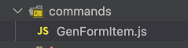

# vscode-plugin-command-runner README

一个可以自定义 js 命令的插件, 自定义命令可以使用 vscode 的基础功能

## 示例

<video src="res/gen-form-item.mp4" controls title="Title"></video>

## 示例配置如下

- 1. 在工程根目录, 创建配置文件: `command-runner.json`

```json
[
  {
    "label": "生成FormItem",
    "jsModule": "./commands/GenFormItem.js"
  }
]
```

- 2. 然后创建对应的目录和文件



- 3. js 脚本的内容

示例脚本功能: 
> 解析光标当前行的文本, 生成FormItem

```js
// GenFormItem.js
async ({ vscode }) => {
  const editor = vscode.window.activeTextEditor;
  if (editor) {
    // 获取光标所在位置
    const position = editor.selection.active;
    // 获取当前行
    const line = editor.document.lineAt(position.line);

    const startIndex = line.firstNonWhitespaceCharacterIndex;
    const endIndex = line.range.end.character;
    // 构造有效部分的范围
    const range = new vscode.Range(
      position.line,
      startIndex,
      position.line,
      endIndex
    );

    const lineContent = line.text;

    const [formItemText, controllerText] = lineContent.trim().split(";");

    const [label, name, span2 = ""] = formItemText.split(",");
    const [controllerName, modelName = name, enumName = ""] =
      controllerText.split(",");

    let result = `<NFormItem label="${label}" name="${name}" ${span2}>
          <${controllerName} v-model:value="model.${modelName}" ${
      enumName ? 'name="' + enumName + '"' : ""
    } />
        </NFormItem>`;

    /**
     * 标题 name span2;NInput
     * =>
     *  <NFormItem label="标题" name="name" span2>
          <NInput v-model:value="model.name" />
        </NFormItem>
     */

    // 替换当前行的文本
    editor.edit((builder) => {
      builder.replace(range, result);
    });

    // vscode.env.clipboard.writeText(line).then(() => {
    //   vscode.window.showInformationMessage(line);
    // });
  }
};
```

- 4. 使用

> a. 输入命令, `> Command Runner: ShowCommands` 或者 快捷键 Cmd+E(mac), Ctrl+E(win), 可以打开脚本菜单


> b. 选择脚本, 回车就可以执行


## Features

可运行js脚本

## Requirements

None

## Extension Settings

None for now

<!-- Include if your extension adds any VS Code settings through the `contributes.configuration` extension point.

For example:

This extension contributes the following settings:

* `myExtension.enable`: Enable/disable this extension.
* `myExtension.thing`: Set to `blah` to do something. -->

## Known Issues

None

## Release Notes

Users appreciate release notes as you update your extension.

### 0.0.1

a demo version

## Following extension guidelines

None

<!-- Ensure that you've read through the extensions guidelines and follow the best practices for creating your extension.

* [Extension Guidelines](https://code.visualstudio.com/api/references/extension-guidelines) -->

## For more information

- [Visual Studio Code's Markdown Support](http://code.visualstudio.com/docs/languages/markdown)
- [Markdown Syntax Reference](https://help.github.com/articles/markdown-basics/)

**Enjoy!**
